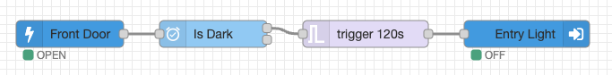

A collection of useful nodes to help with time based automation.  

Despite the large number of timer nodes available for node red i never found one i was satisfied with.  Some were far too simple and others way too complicated.  In the end i made my own which are indended to be reliable & easy to use with a clean design.

### Timer Node
Daily on/off timer node that supports fixed times of the day or sun events.  Useful for setting timers such as lights that go on when its dark and off of at a fixed time.

### Time Check Node
Time check node for testing if a time (default current time) is within the set range including sun events. The original message is forwarded to different outputs based on pass/fail.

### Schedule Node
Set events for a weekly schedule using a visual calendar.  Useful for schedules such as heating where you have a morning time, evening time and these may vary at the weekend.

